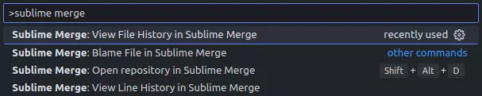
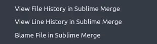

# History In Sublime Merge

[](https://marketplace.visualstudio.com/items?itemName=adhamu.history-in-sublime-merge)
[](https://marketplace.visualstudio.com/items?itemName=adhamu.history-in-sublime-merge)
[](https://marketplace.visualstudio.com/items?itemName=adhamu.history-in-sublime-merge)
[](https://open-vsx.org/extension/adhamu/history-in-sublime-merge)

Adds Sublime Merge commands to VSCode/VSCodium.

To differentiate between other Sublime Merge plugins, this one isn't concerned with what workspace (multi or single) you have setup.

Whatever file you have open, it will traverse up the directory structure and find the appropriate `.git` repository.

## Features

- Open Repository
- View File History
- View Line History
- Blame File

### Command Palette



### Explorer Context Menu


### Editor Context Menu



## Installation

```sh
ext install adhamu.history-in-sublime-merge
```

## Requirements

Ensure the `smerge` command is in your `$PATH`.

[Details can be found here](https://www.sublimemerge.com/docs/command_line)

## Settings

### `history-in-sublime-merge.path`

Edit this value to override the path to Sublime Merge. When not set, the default path, depending on the operating system, is used.
